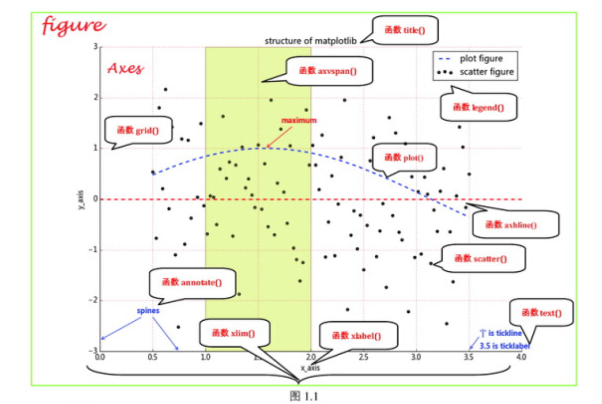

# python-matplotlib-practices

## 《Python 数据可视化之 matplotlib 实践》配套代码



```bash
docker run -it --rm -p 10000:8888 \
-v ~/work/code/py_code/python-matplotlib-practices:/home/jovyan/work \
jupyter/minimal-notebook:x86_64-python-3.11.6

pip install -r requirements.txt -i https://pypi.tuna.tsinghua.edu.cn/simple

find . -name "*.ipynb" -exec black {} \;
find . -name "*.py" -exec black {} \;

find . -name "*ipynb_checkpoints*" -exec rm -rf {} \;

```
